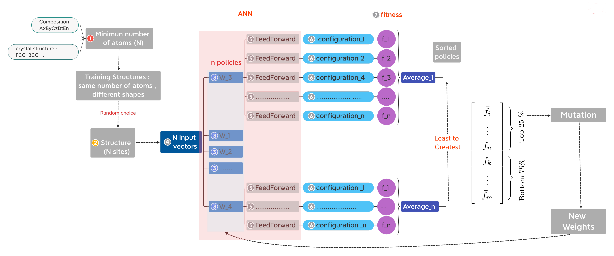
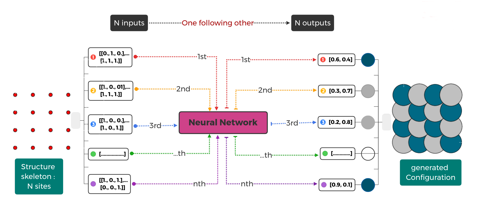

genheas
=======

genheas (Generate High Entropy Alloys Structures) is a  neural evolution structures (NESs) generation methodology
combining artificial neural networks (ANNs) and evolutionary algorithms (EAs) to generate High Entropy Alloys (HEAs).

Support and Documentation
-------------------------
see docs for documentation, reporting bugs, and getting support.

Installation
-------------------------

- Install poetry (https://github.com/python-poetry/poetry)

    + osx / linux / bashonwindows install instructions
        .. sourcecode:: bash
            recommended
            $ curl -sSL https://raw.githubusercontent.com/python-poetry/poetry/master/install-poetry.py | python -

            other possibility
            $ pip install poetry

    + windows powershell install instructions
        .. sourcecode:: bash
            recommended
            $ (Invoke-WebRequest -Uri https://raw.githubusercontent.com/python-poetry/poetry/master/install-poetry.py -UseBasicParsing).Content | python -

other possibility
            $ pip install poetry

- Once Poetry is installed you can execute the following:

.. sourcecode:: bash

    $ poetry --version

    $ poetry self update

- Clone the repo

.. sourcecode:: bash

    $ git clone  https://github.com/CLEANit/genheas

    $ cd genheas

- Create a Virtual Environment

    By default, Poetry create virtual environment in $HOME/.poetry/env or  $HOME/.cache/pypoetry/virtualenvs for cahcing/sharing purpose
        - to install install dependencies to current python interpreter/virtualenv
        .. sourcecode:: bash

            $genheas poetry config virtualenvs.create false --local

        - create virtual environment in default location
        .. sourcecode:: bash

            $genheas poetry config virtualenvs.create

        -   create virtual environment in th root directory of a Python project
        .. sourcecode:: bash

            $genheas poetry config virtualenvs.in-project true

        -   To change or otherwise add a new configuration setting,
        .. sourcecode:: bash

            $genheas poetry config virtualenvs.path /path/to/cache/directory/virtualenvs

- install the packages
.. sourcecode:: bash

    $genheas poetry install

    $genheas poetry check

    $genheas poetry run pytest

    $genheas poetry build

+ Listing the current configuration

    .. sourcecode:: bash

        $genheas poetry config --list

    which will give you something similar to this

    .. sourcecode:: bash

        cache-dir = "/path/to/cache/directory"
        virtualenvs.create = true
        virtualenvs.in-project = null
        virtualenvs.path = "{cache-dir}/virtualenvs"  # /path/to/cache/directory/virtualenvs

+ Show Information of the Vitual Environment

    .. sourcecode:: bash

        poetry env info

        Virtualenv
        Python:         3.8.5
        Implementation: CPython
        Path:           "/path/to/cache/poetry virtual environment"
        Valid:          True

        System
        Platform: linux
        OS:       posix
        Python:   /home/ctetsass/anaconda3

+ Activate Virtual Environment

.. sourcecode:: bash

    $genheas poetry shell

Usage
-------------------------

Here is the schematic of the workflow to generate HEAs structures:

- train.y

    use small cell to train the model

- generate.py

    use the trained model to general large cell

- Therefore, it should looks like:

    1- Train the model  and generate structure
        - Edit the configuration file both training and generation part
        - copy the configuration file to the "root_dir" and edit
        .. sourcecode:: bash
            $genheas/  cp  genheas/parameters_template.yml  rootdir/parameters.yml
            $root_dir  vi parameters.yml

        - running from  <workdir>
        .. sourcecode:: bash

            $ cd  workdir after the activation of the virtual enviroment
            $workdir   python main.py rootdir

        - running in the <genheas/genheas> directory
        .. sourcecode:: bash

            $genheas/genheas  poetry run python main.py rootdir

    2- Only train a model
        - Edit the configuration file : training part

        .. sourcecode:: bash

            $root_dir vi parameters.yml

        - run
        .. sourcecode:: bash

            $workdir   python train.py rootdir

    3 - Using a pre-trained model to generate cell
        - Edit the configuration file : generation part

        .. sourcecode:: bash

            $root_dir vi parameters.yml

        - run
        .. sourcecode:: bash

            $workdir   python  generate.py root_dir

Developing and Contributing
---------------------------
See
`contributing.md <https://https://github.com/CLEANit/genheas/docs/source/contributing.rst>`_
for guidelines on running tests, adding features, coding style, and updating
documentation when developing in or contributing to genheas

Authors
-------

Conrard Tetsassi
