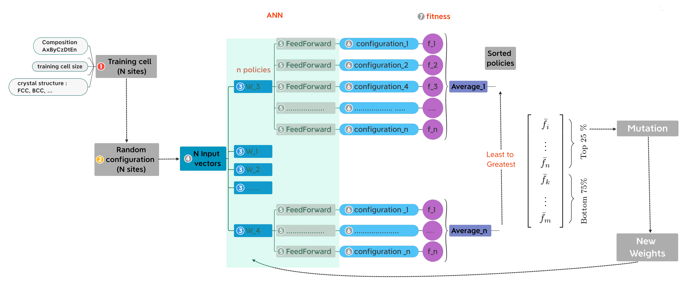
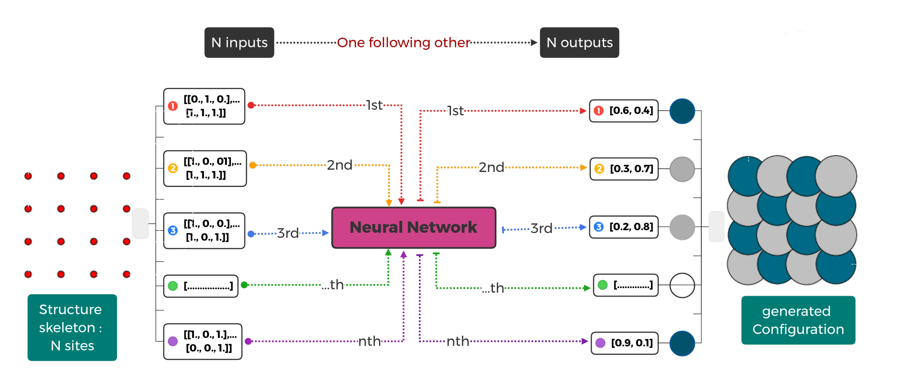

====================
How to use genheas
====================

Overview
========

Generate High Entropy Alloys Structures

A  neural evolution structures (NESs) generation methodology
combining artificial neural networks (ANNs) and evolutionary algorithms (EAs) to generate High Entropy Alloys (HEAs)

genheas workflow
================

Here is the schematic of the workflow to generate HEAs structures:

+ train.y

    use small cell to train the model

+ generate.py

    use the trained model to general large cell

Therefore, it should looks like:

1- Train the model  and generate structure

    + Edit the configuration file both training and generation part

    .. sourcecode:: bash

        vi parameters.yml

    + run

    .. sourcecode:: bash

        poetry run python main.py

2- Only train a model

    + Edit the configuration file : training part

    .. sourcecode:: bash

        vi parameters.yml

    + run

    .. sourcecode:: bash

        poetry run python train.py

3 - Using a pre-trained model to generate cell

    + Edit the configuration file : generation part

    .. sourcecode:: bash

        vi parameters.yml

    + run

    .. sourcecode:: bash

        poetry run python generate.py

